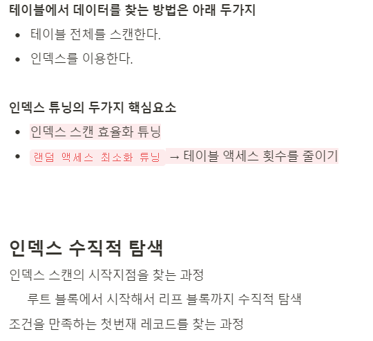
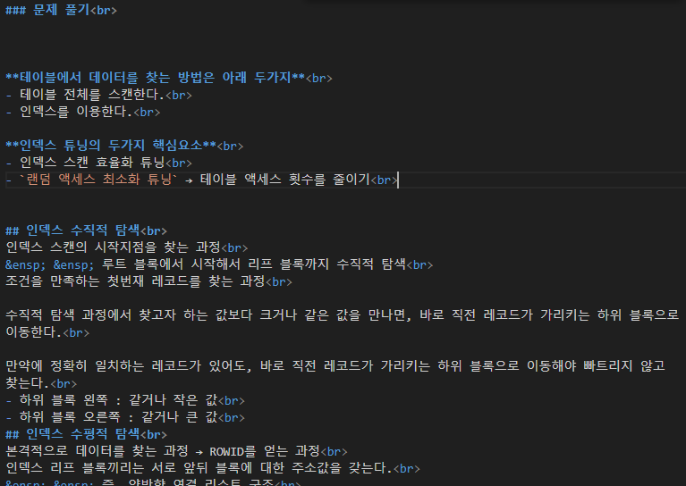

# 노션 글을 깃헙으로 연동하기

## Usage
### 1. config.json 파일 셋팅
    - Notion API 토큰
    - Notion Database ID
    - Notion Block(Page) ID
    
###2. main.py 파일 실행

#### [Notion 글]

#### [마크다운으로 변경한 글]

## To-Be
1. Database에서 플래그 값으로 가져올 Block 선별하기

### 참고
* *Read More : https://roongstar.tistory.com/manage/newpost/?type=post&returnURL=%2Fmanage%2Fposts%2F*
* *API 문서 : https://developers.notion.com/reference/get-block-children*
