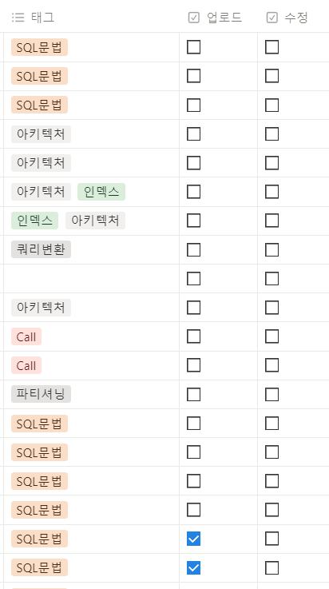

# 노션 글을 깃헙으로 연동하기

* 파이썬 버전 : 3.6

## Usage
### 1. config.json 파일 셋팅
    - Notion API 토큰
    - Notion Database ID
    - Notion Block(Page) ID
    
### 2. main.py 파일 실행

#### [Notion 글]

#### [마크다운으로 변경한 글]

## To-Be
1. Database에서 플래그 값으로 가져올 Block 선별하기
   
   
   
    - 현재) 업로드에 체크된 값만 가져오도록 되어있음
    - NEXT) 업로드 & 수정 플래그를 확인해서 업데이트 된 페이지도 가져오도록 구현 (업로드 후엔 수정 체크박스 해제되도록)
            추가로, Notion에서 페이지에 변경이 생겼을 때 수동이 자동으로 체크할 수 있는 방법이 있는지 찾아보기
3. notion에서 제공해주는 image링크는 영구적인게 아니였다 ㅠㅠ
   이미지를 가져와서 저장하는 과정도 필요함
   
### 참고
* *Read More : https://roongstar.tistory.com/manage/newpost/?type=post&returnURL=%2Fmanage%2Fposts%2F*
* *API 문서 : https://developers.notion.com/reference/get-block-children*
